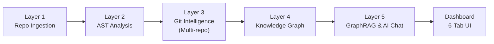

# AIL — Full End-to-End Build Walkthrough

## What Was Built

The complete AIL (Architectural Intelligence Layer) pipeline: 5 analysis layers + a rich 6-tab VS Code dashboard integrated with an AI architectural assistant.

## System Architecture Updates

### Layer 3 — Git Intelligence (Nested/Monorepo Support)
Layer 3 was upgraded to recursively search for `.git` folders across the entire VS Code workspace. This means AIL now perfectly supports:
* Monorepos with multiple sub-projects.
* Workspaces where the `.git` root is a parent folder.
* Repositories with nested submodules.

File paths extracted from Git history are automatically normalized relative to the workspace root, merging Git churn data perfectly with AST entity nodes from Layer 2.

### Layer 5 — GraphRAG (NEW)
We introduced the Architectural GraphRAG engine which powers the AI assistant. 
1. **Semantic Text Generation**: It maps Knowledge Graph nodes (entities, properties, Git churn stats) into rich text representations.
2. **Hybrid Retrieval**: Extracts keywords from the user's prompt and matches them against the Semantic Index.
3. **Graph Traversal**: Grabs the matched semantic nodes and traverses the Layer 4 graph edges to pull connected nodes (e.g., "Function X calls Function Y in File Z").
4. **LLM Generation**: Feeds this highly specific, context-rich architectural snapshot into Azure OpenAI to answer your questions accurately.

## Dashboard Tabs

1. **Pipeline** — status cards for each layer, run buttons, auto-continue, overview stats
2. **Entities** — searchable/sortable table of functions, classes etc. with type tags
3. **Complexity** — cyclomatic complexity bars, nesting depth, function sorting
4. **Git Intel** — recent commits, contributor stats, file churn with hot/stale badges
5. **Graph** — knowledge graph stats + architecture summary text + interactive `vis.js` visualization
6. **Assistant ✨** — A GraphRAG-powered chat interface connected to Azure OpenAI.

---

## How to Set Up Azure OpenAI for the Assistant

To use the **Assistant ✨** tab, you need to configure your Azure OpenAI credentials in VS Code so AIL can send GraphRAG queries to your deployed LLM.

### Step 1: Get Your Azure OpenAI Credentials
1. Log in to the [Azure Portal](https://portal.azure.com/).
2. Navigate to your **Azure OpenAI Resource**.
3. Under the **Resource Management** section on the left sidebar, click **Keys and Endpoint**.
4. Copy **KEY 1** (or KEY 2) and the **Endpoint URL** (it looks like `https://<your-resource-name>.openai.azure.com/`).
5. Open **Azure AI Studio** (via the portal) and go to your **Deployments**. Note the exact name of your chat deployment (e.g., `gpt-4o`).

### Step 2: Configure the AIL Extension in VS Code
1. Open VS Code Settings (`Ctrl + ,` or `Cmd + ,`).
2. Type `AIL` in the settings search bar.
3. You will see the new configuration fields under the AIL extension:
   * **Azure Open Ai Endpoint**: Paste your Endpoint URL here.
   * **Azure Open Ai Api Key**: Paste your Key here.
   * **Azure Open Ai Deployment**: Enter your chat model deployment name (default is `gpt-4o`).
   * **Azure Open Ai Embed Deployment**: *(Optional for future use)* Enter your embedding model deployment name.

### Step 3: Run the Pipeline and Chat!
1. Open the AIL Dashboard (`Ctrl/Cmd + Shift + P` -> `Run AIL Analysis`).
2. Click **Run Full Pipeline** on the Pipeline tab and let it process through all 5 layers.
3. Once Layer 5 is complete, navigate to the **Assistant ✨** tab.
4. Try asking an architectural question like: 
   * *"Which functions interact with the database?"*
   * *"What are the most complex files based on Git churn?"*
   * *"How does the authentication flow work in this codebase?"*
