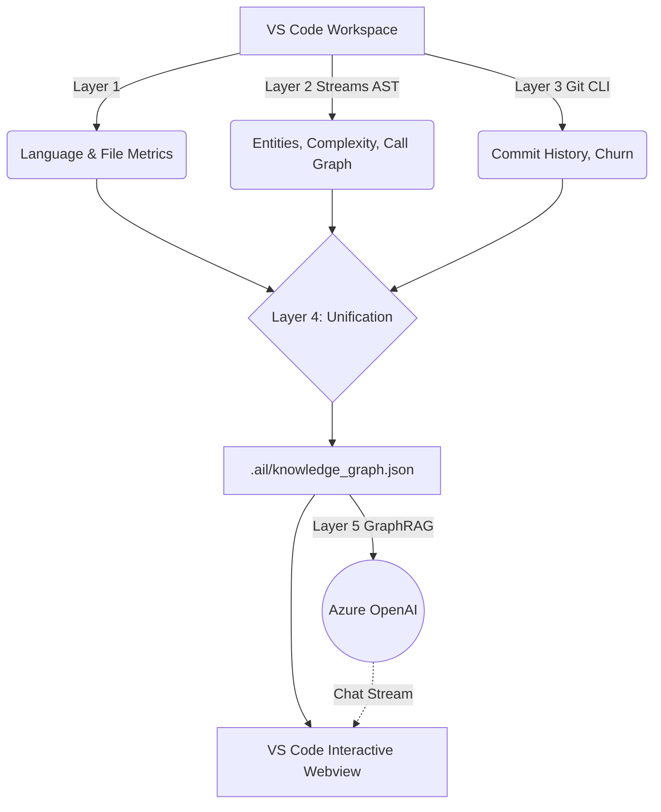

# AIL — Architectural Intelligence Layer

AIL is an advanced VS Code Extension designed to automatically ingest, parse, and analyze massive code repositories, outputting a highly structured, unified **Knowledge Graph** of the entire codebase architecture. It includes an integrated AI **GraphRAG Assistant** to answer architectural questions instantly.

## How the Pipeline Works

The analysis pipeline processes the active VS Code workspace (including monorepos and nested submodules) through 5 distinct layers:

### Layer 1: Repository Ingestion
Scans the filesystem, identifies languages, categorizes entry points, and provides high-level metrics of the workspace.

### Layer 2: Abstract Syntax Tree (AST) Extraction
Uses `web-tree-sitter` (via a batched, RAM-optimized streaming architecture) to parse every source file.
- **Extracts Entities:** Classes, interfaces, functions, methods.
- **Maps Imports:** Identifies all intra-file dependencies.
- **Builds Call Graphs:** Performs best-effort static tracing to approximate which functions call which other functions.
- **Calculates Complexity:** Scores every function's cyclomatic complexity and nesting depth.

### Layer 3: Git Intelligence (Multi-Repo Support)
Recursively finds all `.git` repositories in the workspace, retrieves historical data directly via the CLI (`git log`, `git shortlog`), and normalizes paths to match the AST data perfectly.
- Computes **File Churn** (identifying "Hot" frequently changed files vs. "Stale" legacy files).
- Extracts contributors and recent commit timelines.

### Layer 4: Knowledge Graph Unification
Merges the structural code logic (L2) with the historical metrics (L3) using relative file paths as keys. The result is a unified graph where nodes not only link to their dependencies (Imports/Calls) but also carry vulnerability weights (Complexity/Churn).

### Layer 5: GraphRAG & AI Chat
Uses the generated Knowledge Graph to power an architectural AI assistant.
- Generates semantic text representations of all graph nodes (including churn and complexity stats).
- Uses **Hybrid Retrieval** (keyword matching + graph edge traversal) to pull precisely the right architectural context.
- Feeds this context to **Azure OpenAI** to answer complex questions about your codebase topology.

---

## The Dashboard UI
AIL features a rich interactive webview containing 6 tabs:
1. **Pipeline:** Status cards for each layer, run buttons, auto-continue, overview stats.
2. **Entities:** Searchable/sortable table of every element in the codebase.
3. **Complexity:** Cyclomatic complexity heatmaps and nesting depth metrics.
4. **Git Intel:** Hot/stale file indicators and contributor histories.
5. **Graph:** An interactive, physics-based `vis-network` topology map showing exactly how your modules, classes, and functions are physically wired together.
6. **Assistant ✨:** A GraphRAG-powered chat interface connected to Azure OpenAI.

---

## How to Set Up the Assistant (Azure OpenAI)

To use the **Assistant ✨** tab, you need to configure your Azure OpenAI credentials in VS Code so AIL can send GraphRAG queries to your deployed LLM.

1. Open VS Code **Settings** (`Ctrl + ,` or `Cmd + ,`).
2. Search for **AIL** in the settings.
3. Configure the following fields:
   * **Azure Open Ai Endpoint**: Your Azure OpenAI Endpoint URL (e.g., `https://my-resource.openai.azure.com/`).
   * **Azure Open Ai Api Key**: Your Azure API Key.
   * **Azure Open Ai Deployment**: Your chat model deployment name (default is `gpt-4o`).

Once configured, simply open the AIL Dashboard (`Ctrl/Cmd + Shift + P` -> `Run AIL Analysis`), hit **Run Full Pipeline**, and then navigate to the **Assistant** tab to start asking questions!

---

## System Architecture Details

### The "AIL-Native" Advantage
**Why Semantic Relationships (Vector DBs) alone are insufficient:**
A standard Vector RAG setup embeds code fuzzily. If you ask about "login", it brings back strings containing "login". However, it has no concept of *topology*. 

AIL mathematically verifies through AST parsing that `File A` precisely calls `Function B`. Because AIL exports this exact **Call Graph** and **Relationships** map directly, adding another layer of fuzzy "semantic understanding" on top to discover relationships is entirely irrelevant and wasteful. The JSON *already is* the ground truth relationship map. With Layer 5, we traverse this physical graph to provide exact context to the LLM.

### Output Pipeline Architecture

