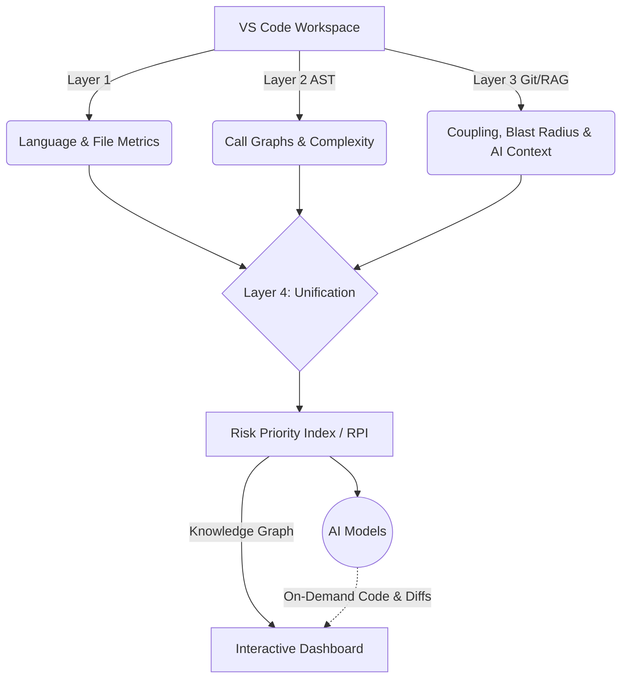

# AIL — Architectural Intelligence Layer

AIL is an advanced VS Code Extension designed to automatically ingest, parse, and analyze massive code repositories, outputting a highly structured, unified **Knowledge Graph** of the entire codebase architecture. It includes an integrated AI **GraphRAG Assistant** to answer technical architectural questions with implementation-level precision.

## The 4-Layer Intelligence Pipeline

AIL processes your workspace through a deterministic multi-layer pipeline:

### Layer 1: Repository Ingestion
Scans the filesystem, identifies languages, categorizes entry points, and provides high-level metrics of the workspace.

### Layer 2: Abstract Syntax Tree (AST) Extraction
Uses `web-tree-sitter` via a RAM-optimized streaming architecture to parse every source file.
- **Extracts Entities:** Classes, interfaces, functions, methods.
- **Maps Imports:** Identifies all intra-file dependencies.
- **Builds Call Graphs:** Static tracing to map function calls.
- **Calculates Complexity:** Scores cyclomatic complexity and nesting depth.

### Layer 3: Git Intelligence & Hybrid RAG
Combines historical data with an integrated AI assistant to answer technical architectural questions.
- **Co-Change Coupling:** Builds a co-change matrix to reveal hidden architectural bounds (files that always change together).
- **Commit Blast Radius:** Computes the direct and transitive impact of every commit.
- **File Churn:** Identifies "Hot" vs. "Stale" files.
- **Hybrid Code-Aware RAG:** Dynamically chooses between Metadata-only RAG and Implementation-Aware RAG.
- **On-Demand Snippets:** Fetches actual source code snippets on-the-fly for queries.

### Layer 4: Knowledge Graph & Risk Scoring
Merges structural logic (L2) with historical metrics & AI insights (L3) into a unified interactive graph.
- **Risk Priority Index (RPI):** A proprietary score calculated as: `(Complexity * 0.4) + (Churn * 0.4) + (Coupling * 0.2)`.
- Identifies critical hotspots where high complexity meets high volatility.

---

## The Dashboard UI

AIL features a rich interactive webview containing:
1. **Pipeline:** Status cards for each layer and real-time analysis logs.
2. **Entities:** Searchable/sortable table of every element in the codebase.
3. **Risk:** A leaderboard of functions/files ranked by **RPI score** to focus refactoring efforts.
4. **Git Intel:** Visualization of churn, co-change coupling, and commit impact.
5. **Graph:** An interactive `vis-network` topology map with specialized modes:
   - **Risk Heatmap:** Color nodes by RPI (Green → Red).
   - **Impact Explorer:** Click a node to see its full transitive dependency chain.
   - **Coupling Clusters:** Groups files that co-change together.
6. **Assistant:** A RAG-powered chat interface supporting Azure OpenAI and Google Gemini.

---

## 🛠️ Configuration

AIL supports both Azure OpenAI and Google Gemini.

1. Open VS Code **Settings** (`Ctrl + ,`).
2. Search for **AIL**.
3. **For Google Gemini:**
   - Set `Ai Provider` to `gemini`.
   - Enter your `Gemini Api Key`.
   - Select `Gemini Model` (e.g., `gemini-2.0-flash`).
4. **For Azure OpenAI:**
   - Set `Ai Provider` to `azure`.
   - Configure `Endpoint`, `Api Key`, and `Deployment Name`.

---

## System Architecture

AIL avoids the pitfalls of standard Vector RAG by using the **Knowledge Graph as Ground Truth**.

Instead of fuzzy semantic matching to find relationships, AIL mathematically verifies them via AST. The RAG engine then "traverses" this physical graph to provide the LLM with the exact neighborhood (calls/imports) of the code in question, rather than just similar-sounding strings.

