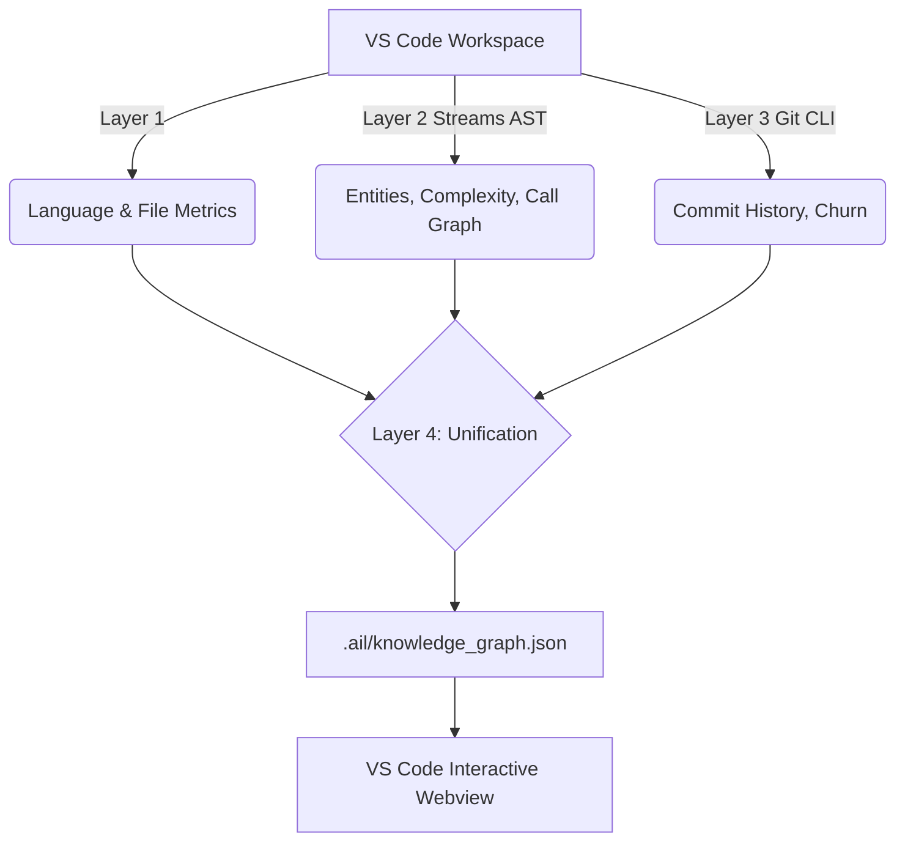
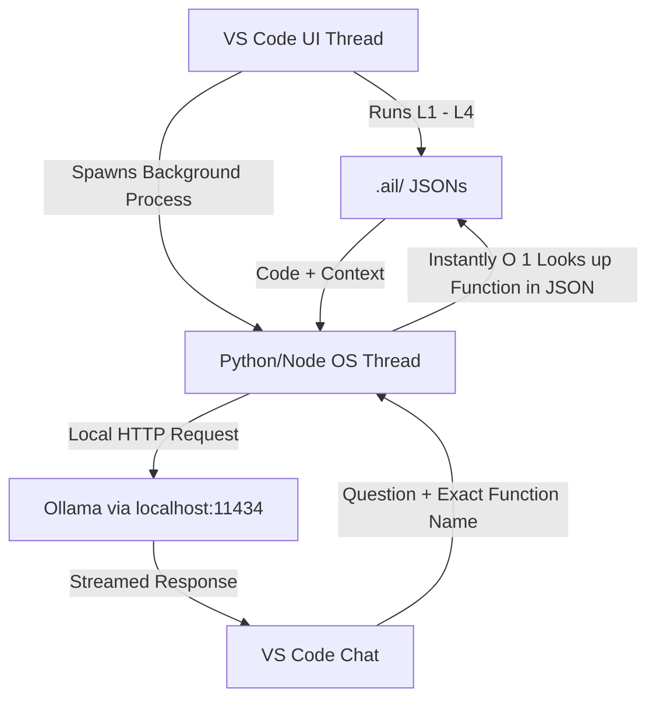
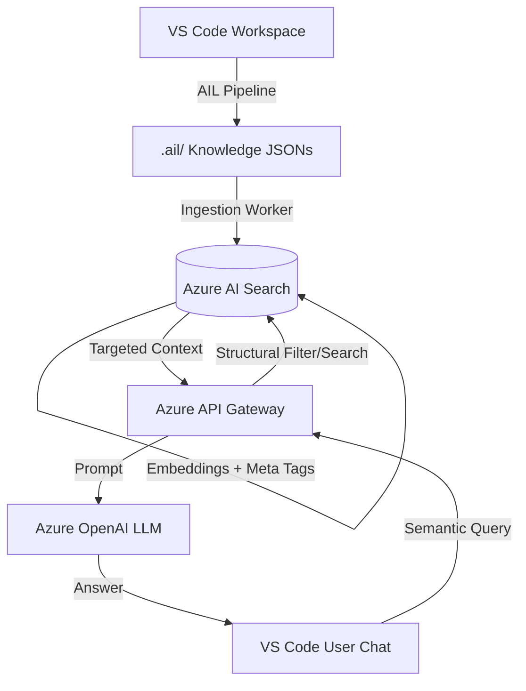

# AIL — Architectural Intelligence Layer

AIL is an advanced VS Code Extension designed to automatically ingest, parse, and analyze massive code repositories, outputting a highly structured, unified **Knowledge Graph** of the entire codebase architecture.

## How the Pipeline Works

The analysis pipeline processes the active VS Code workspace through 4 distinct layers:

### Layer 1: Repository Ingestion
Scans the filesystem, identifies languages, categorizes entry points, and provides high-level metrics of the workspace.

### Layer 2: Abstract Syntax Tree (AST) Extraction
Uses `web-tree-sitter` (via a batched, RAM-optimized streaming architecture) to parse every source file.
- **Extracts Entities:** Classes, interfaces, functions, methods.
- **Maps Imports:** Identifies all intra-file dependencies.
- **Builds Call Graphs:** Exactly traces which functions call which other functions.
- **Calculates Complexity:** Scores every function's cyclomatic complexity and nesting depth.

### Layer 3: Git Intelligence
Retrieves historical data directly via the CLI (`git log`, `git shortlog`).
- Computes **File Churn** (identifying "Hot" frequently changed files vs. "Stale" legacy files).
- Extracts contributors and recent commit timelines.

### Layer 4: Knowledge Graph Unification
Merges the structural code logic (L2) with the historical metrics (L3) using relative file paths as keys. The result is a unified graph where nodes not only link to their dependencies (Imports/Calls) but also carry vulnerability weights (Complexity/Churn).

---

## The Dashboard UI
AIL features a rich interactive webview containing:
- **Entities & Complexity Heatmaps:** Sortable lists of every element in the codebase.
- **Git Intel:** Hot file indicators and contributor histories.
- **Interactive Architecture Graph:** A physics-based `vis-network` topology map showing exactly how your modules, classes, and functions are physically wired together. 

---

## AI & LLM Integration Strategies

The primary goal of AIL is to compress a 27,000+ file repository into a highly rigid JSON map so an LLM can reason about global architecture without running out of tokens.

### The "AIL-Native" Advantage
**Why Semantic Relationships (Vector DBs) alone are insufficient:**
A standard Vector RAG setup embeds code fuzzily. If you ask about "login", it brings back strings containing "login". However, it has no concept of *topology*. 

AIL mathematically verifies through AST parsing that `File A` precisely calls `Function B`. Because AIL exports this exact **Call Graph** and **Relationships** map directly, adding another layer of fuzzy "semantic understanding" on top to discover relationships is entirely irrelevant and wasteful. The JSON *already is* the ground truth relationship map.

### Strategy A: Small Repos (< 100 Files)
**Direct Context Injection (Fastest, Cheapest):**
Since the output `knowledge_graph.json` is small, we skip all databases. The JSON is injected directly into the LLM system prompt. The LLM gets a complete, 10,000-foot view of every structural and historical dependency simultaneously.

### Strategy B: Massive Repos (> 100 Files)
**Graph-Augmented RAG (Azure AI Search):**
When the repository is too large for the context window, we utilize a Vector DB as a filter, not as an oracle. 
1. The AIL worker uploads the code snippets to Azure AI Search, attaching the AIL metrics (`complexity: 25`, `isHot: true`) as metadata tags on the embeddings.
2. The User asks a question in the chat.
3. The query searches the Vector DB, but the retrieval logic uses the AIL JSON to mathematically ensure the LLM receives the flagged snippet *alongside* its directly connected Call Graph dependencies, specifically boosting files marked as highly complex or heavily churned.

### Strategy C: The High-Speed Prototype (Local/Ollama)
For extremely fast, hackathon-style prototyping, skip the network latency.
- Run a background OS/Node thread directly in the extension.
- Load the AIL JSON into a standard application memory Dictionary (HashMap).
- Perform `O(1)` memory lookups against the function names.
- Send the curated JSON prompt to a local instance of Ollama (`localhost:11434`), streaming the answer directly back to the VS Code UI within milliseconds, never freezing the main Node.js UI thread.

## Architecture Diagrams

### The AIL Extension Pipeline

### The Fast Local Prototype Strategy (Ollama)

### The Enterprise Cloud Strategy (Azure AI Search)

