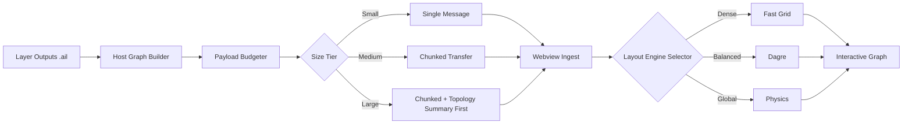
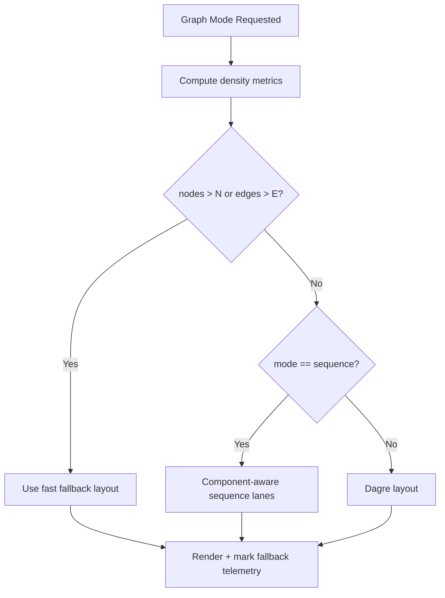
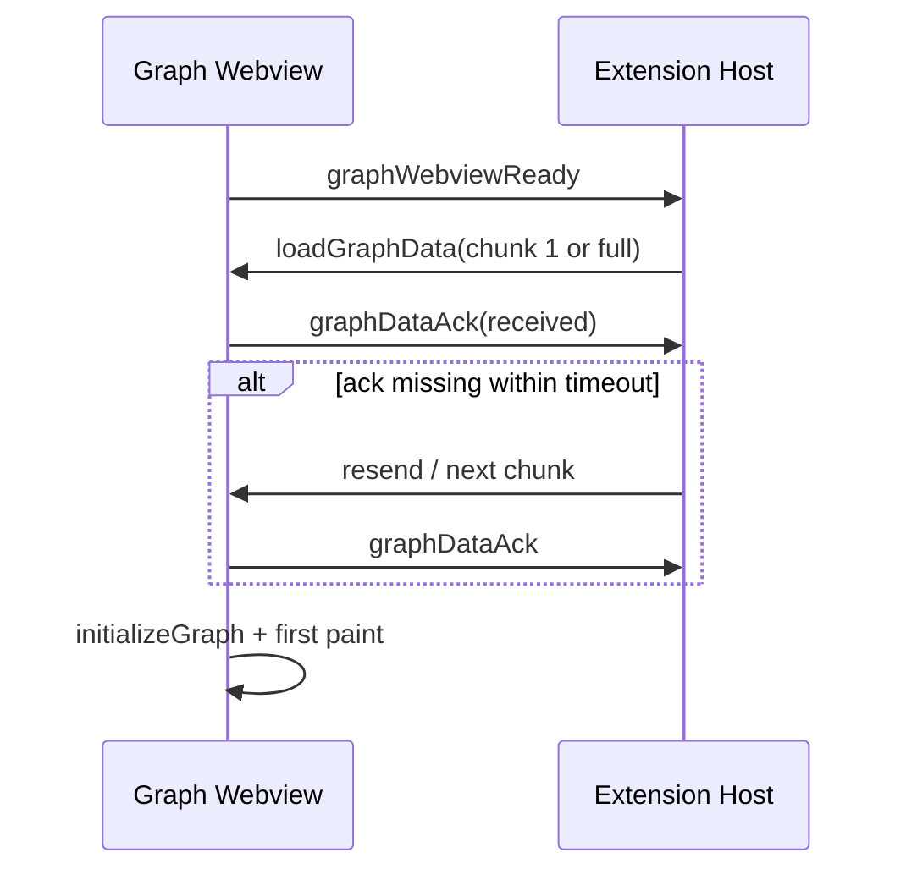

# AIL Refinement Plan (Large Repo First)

## Hackathon Mode (Ship in 1-2 Days)

If the goal is "works across repo sizes" instead of perfect architecture, use this compressed track.

### Non-Negotiable Scope

1. Graph must always open.
2. Graph must never stay on infinite loading.
3. Expand/collapse must not lose baseline nodes.
4. Sequence mode must be clearly labeled as static/inferred.
5. Dashboard + highlights must remain stable.

### Feature Cuts (For Now)

- No full chunk protocol unless current retry path still fails.
- No advanced LLM narrative sequence in this sprint.
- No deep animation polish or advanced clustering UX.
- No broad refactors that risk regressions outside graph reliability.

### 48-Hour Execution Plan

#### Block 1 (2-4h): Reliability locks

- Keep payload pruning + ready/ack + retry enabled.
- Add hard timeout fallback banner with "Reload Graph" action.
- Add last-resort render mode: if layout throws, force simple vertical list layout.

#### Block 2 (3-5h): Interaction correctness

- Finalize expand provenance model (baseline vs expanded).
- Add regression guard for collapse on nodes with shared descendants.
- Keep disjoint sequence lanes so components do not overlap.

#### Block 3 (2-4h): UX clarity

- Keep depth legend visible in function/directory/sequence views.
- Add tiny "mode semantics" line under each mode selector.
- Show "rendered vs total" counts in header at all times.

#### Block 4 (2-3h): Smoke testing matrix

- Test small repo, medium repo, large repo (Gitea-style).
- Test mode switch spam, expand/collapse spam, and reopen graph panel.
- Confirm no host freeze and no infinite loaders.

#### Block 5 (1-2h): Demo prep

- Record one stable walkthrough path (analysis -> dashboard -> graph -> explain node).
- Prepare fallback script: if sequence questioned, state "static topology sequence".
- Keep one command to reset cache and rerun cleanly.

### Hackathon Definition of Done

1. On three different repo sizes, Graph View opens within 5 seconds.
2. No "stuck loading" after 3 reopen attempts.
3. No disappearing nodes on expand/collapse.
4. Clear legends and mode disclaimer visible.
5. End-to-end demo runs without manual code edits mid-demo.

## Why this plan exists

AIL already delivers strong architectural analysis, but large repositories expose stress points across transport, rendering, orchestration latency, and UX clarity. This plan focuses on making large-repo behavior predictable, fast, and explainable while also tightening overall quality.

## North-Star Outcomes

1. Open Graph View in under 3 seconds for repos with 10k+ entities.
2. Never show indefinite loading states.
3. Make every major UI mode explain what users are seeing and what it is not.
4. Keep extension host responsive during all layers.
5. Establish repeatable performance gates in CI before shipping.

## Current Constraints and Pain Points

- Very large graphs pressure webview message transport.
- Layout can stall on dense graphs when using expensive algorithms universally.
- Sequence mode can look misleading for disjoint call components.
- Expand/collapse interactions can be brittle without strict node provenance.
- Feature growth risks inconsistent docs, telemetry, and regression coverage.

## System Refinement Strategy

### Pillar A: Data Pipeline and Transport Hardening

- Enforce host-side payload budgeting for all graph modes.
- Introduce chunked graph transport protocol for huge payloads.
- Add explicit ready/ack and timeout fallback for each transfer.
- Persist a compact graph cache keyed by analysis fingerprint.

### Pillar B: Rendering and Interaction Resilience

- Tiered layout strategy:
  - Tier 1: Fast grid/column fallback for dense graphs.
  - Tier 2: Dagre for medium density.
  - Tier 3: Physics mode for global exploratory views.
- Incremental first paint:
  - Render top-N immediately.
  - Stream in additional nodes/edges progressively.
- Strict expand provenance:
  - Distinguish baseline nodes vs expanded nodes.
  - Collapse only expansion-owned nodes.

### Pillar C: Semantic Clarity in Views

- Distinguish static topology from inferred runtime sequence.
- Add legends and mode disclaimers everywhere they reduce confusion.
- Add confidence labels for inferred order and inferred relationships.

### Pillar D: Observability and Control

- Add lightweight telemetry events:
  - graph_send_start, graph_send_ack, graph_send_timeout
  - layout_fallback_used, layout_duration_ms
  - first_paint_ms, node_click_to_open_ms
- Add debug panel section with transport/layout state for diagnostics.

### Pillar E: Quality, Testing, and Release Discipline

- Add deterministic fixture repos:
  - small, medium, huge, disjoint-heavy, cyclic-heavy.
- Introduce performance budget checks in CI.
- Add visual and interaction regressions for key graph operations.
- Tighten release checklist with docs/changelog parity.

## Architecture Evolution Diagram

## Layout Decision Diagram

## Transport Handshake Diagram

## 12-Week Delivery Plan

### Phase 1 (Weeks 1-2): Stability Baseline

- Finalize transport protocol contracts.
- Add graph timeout error UX everywhere.
- Add strict expand/collapse ownership model across all modes.
- Add sequence component lanes and legend consistency.

Exit criteria:
- No stuck loading in large fixture repo.
- No disappearing nodes in expand/collapse regressions.

### Phase 2 (Weeks 3-5): Performance Core

- Implement chunked graph transfer and progressive render.
- Add graph cache with fingerprint invalidation.
- Add layout tier selector based on density thresholds.

Exit criteria:
- First paint under 1.5s on medium fixture.
- First paint under 3s on huge fixture.

### Phase 3 (Weeks 6-8): Semantic Quality

- Add confidence signals for sequence and inferred relations.
- Add optional LLM-assisted narrative sequence mode (separate from static mode).
- Add path tracing UX (entrypoint to target) with rationale.

Exit criteria:
- Users can distinguish static vs inferred runtime output at a glance.

### Phase 4 (Weeks 9-10): Test and CI Hardening

- Add performance gates and regression snapshots.
- Add interaction tests for open graph, expand/collapse, mode switch, retries.
- Add synthetic chaos tests for delayed/failed message chunks.

Exit criteria:
- CI blocks regressions on latency and correctness budgets.

### Phase 5 (Weeks 11-12): Product Finish

- Documentation synchronization pass.
- Guided onboarding text for each graph mode.
- Release candidate stabilization and rollback playbook.

Exit criteria:
- Release-ready branch with clean changelog and verification report.

## Target Metrics

- Graph data delivery success rate: >= 99.5%
- Graph first meaningful paint (huge fixture): <= 3.0s
- Extension host unresponsive incidents during run: <= 1%
- Expand/collapse correctness regressions: 0
- User confusion reports on sequence semantics: reduced by >= 70%

## Work Breakdown by Code Area

- src/panel/graphPanelManager.ts
  - Chunked transport, retries, ack handling, payload budgeting.
- src/webview/App.tsx
  - Progressive ingest/render, mode legends, fallback routing, sequence confidence UI.
- src/webview/layoutUtils.ts
  - Density-aware layout selection helpers.
- src/webview/FunctionNode.tsx
  - Depth-aware styling and provenance hints.
- src/panel/panelUI.ts
  - Operational diagnostics and release-state visibility.
- test/
  - Fixture-driven integration and interaction regression tests.

## Risks and Mitigations

- Risk: LLM-generated sequence can be overtrusted.
  - Mitigation: keep static and LLM sequence as separate explicit modes.
- Risk: Chunking increases protocol complexity.
  - Mitigation: strict schema + replay-safe message IDs + timeout tests.
- Risk: Aggressive pruning may hide critical nodes.
  - Mitigation: provide transparent pruning stats + load-more controls.

## Definition of Done for Refinement Program

1. Large fixture repos are reliably usable without manual retries.
2. Visual modes are semantically explicit and include legends.
3. Performance budgets are enforced automatically in CI.
4. Docs and changelogs are updated in the same release cycle as code.
