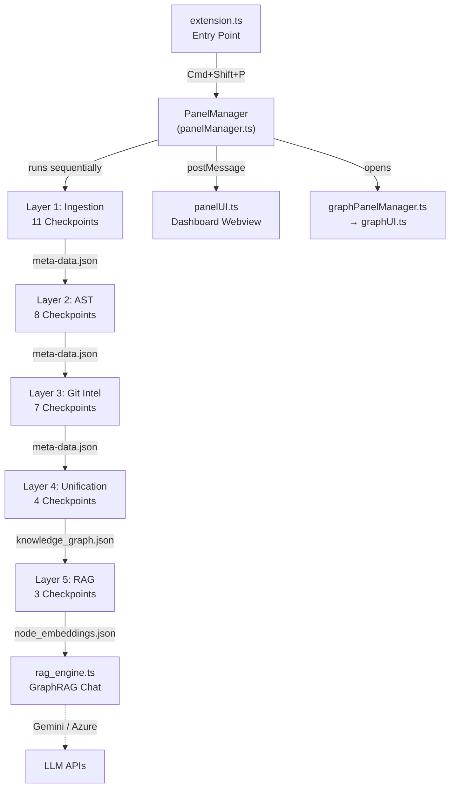

# AIL — Complete Code-Level Walkthrough

> Deep analysis of all 45 source files across 5 pipeline layers, RAG engine, and UI panels.

---

## Architecture at a Glance



---

## Extension Lifecycle

| File | Role |
|---|---|
| [extension.ts](file:///Users/rudrarajpurohit/Desktop/AIL/src/extension.ts) | Registers 2 commands, prompts user for AI provider (Gemini/Azure), fetches available models, stores API keys in VS Code settings, then calls `PanelManager.createOrShow()` |
| [panelManager.ts](file:///Users/rudrarajpurohit/Desktop/AIL/src/panel/panelManager.ts) | Creates the Webview panel, handles all `postMessage` commands (runLayerN, askGraphRAG, requestData, loadGraphs, purgeData), orchestrates pipeline execution, reads all `.ail/` JSON files into the dashboard |
| [panelUI.ts](file:///Users/rudrarajpurohit/Desktop/AIL/src/panel/panelUI.ts) | 658-line HTML/CSS/JS string — renders the dashboard with 8 data panels (overview stats, complexity, churn, risk, blast radius, coupling, entities, chat), manages pipeline state machine, handles chat I/O |
| [graphPanelManager.ts](file:///Users/rudrarajpurohit/Desktop/AIL/src/panel/graphPanelManager.ts) | Opens a separate webview (ViewColumn.Beside) for the interactive `vis-network` graph, handles `jumpToCode` clicks to navigate to source files |
| [graphUI.ts](file:///Users/rudrarajpurohit/Desktop/AIL/src/panel/graphUI.ts) | 22KB HTML/JS for the graph view with Risk Heatmap, Impact Explorer, and Coupling Cluster modes |

---

## Layer 1: Repository Ingestion (11 Checkpoints)

All output goes to `.ail/layer1/`. Synchronous execution.

| CP | File | What It Does | Output |
|---|---|---|---|
| 1 | [cp1_workspace.ts](file:///Users/rudrarajpurohit/Desktop/AIL/src/layer1/checkpoints/cp1_workspace.ts) | Records workspace root path | `workspace_directory.json` |
| 2 | [cp2_filescanner.ts](file:///Users/rudrarajpurohit/Desktop/AIL/src/layer1/checkpoints/cp2_filescanner.ts) | Recursive walk with EXCLUDE_DIRS set, counts extensions, returns `ScannedFile[]` with relative path, extension, size | `file_scan.json` |
| 3 | [cp3_language_detector.ts](file:///Users/rudrarajpurohit/Desktop/AIL/src/layer1/checkpoints/cp3_language_detector.ts) | Maps 15 extensions → languages, computes percentages, determines primary language | `languages.json` |
| 4 | [cp4_framework_scanner.ts](file:///Users/rudrarajpurohit/Desktop/AIL/src/layer1/checkpoints/cp4_framework_scanner.ts) | **380 lines**. Detects frameworks from manifest files (requirements.txt, package.json, pom.xml), Python import scanning, and config file signals. Covers Python (25 frameworks), JS (28), Java (8). | `frameworks.json` |
| 5 | [cp5_entrypoint_finder.ts](file:///Users/rudrarajpurohit/Desktop/AIL/src/layer1/checkpoints/cp5_entrypoint_finder.ts) | **356 lines**. Pattern-matching entry points with confidence scoring. Handles FastAPI, Flask, Django, Express, NestJS, React, Next.js, Vite, Remix, Celery, argparse, Spring Boot, plus filename conventions. | `entry_points.json` |
| 6 | [cp6_metrics.ts](file:///Users/rudrarajpurohit/Desktop/AIL/src/layer1/checkpoints/cp6_metrics.ts) | LOC counting (source files only), top 10 largest files, per-language line breakdown | `metrics.json` |
| 7 | [cp7_execution_model.ts](file:///Users/rudrarajpurohit/Desktop/AIL/src/layer1/checkpoints/cp7_execution_model.ts) | **272 lines**. Multi-signal classifier — detects 16 project categories (Web Service, Frontend, Fullstack, Worker, CLI, ML, AI/LLM, Data Pipeline, GraphQL, gRPC, Mobile, Infrastructure, etc.) with priority-ordered classification | `execution_model.json` |
| 8 | [cp8_dependency_manifest.ts](file:///Users/rudrarajpurohit/Desktop/AIL/src/layer1/checkpoints/cp8_dependency_manifest.ts) | **466 lines**. Parses dependencies from 7 ecosystems: Python (requirements.txt, pyproject.toml, Pipfile, setup.py), JS (package.json, package-lock, yarn.lock), Java (pom.xml, build.gradle), Go (go.mod), Rust (Cargo.toml), Ruby (Gemfile), PHP (composer.json). Separates direct vs transitive. | `dependency_manifest.json` |
| 9 | [cp9_dependency_depth.ts](file:///Users/rudrarajpurohit/Desktop/AIL/src/layer1/checkpoints/cp9_dependency_depth.ts) | Computes dependency chain depth with iterative propagation (max 10 passes), risk assessment based on depth and transitive ratio | `dependency_depth.json` |
| 10 | [cp10_assemble_manifest.ts](file:///Users/rudrarajpurohit/Desktop/AIL/src/layer1/checkpoints/cp10_assemble_manifest.ts) | Assembles all CP outputs into `Layer1Manifest` | `meta-data.json` |
| 11 | [cp11_notify.ts](file:///Users/rudrarajpurohit/Desktop/AIL/src/layer1/checkpoints/cp11_notify.ts) | VS Code info notification with summary | — |

---

## Layer 2: AST Analysis (8 Checkpoints)

Uses `web-tree-sitter` WASM. **Key design**: Per-file streaming in the orchestrator to avoid V8 OOM — each file is parsed, processed through all extractors, then `tree.delete()` frees WASM memory.

| CP | File | What It Does | Output |
|---|---|---|---|
| 1 | [cp1_parser_init.ts](file:///Users/rudrarajpurohit/Desktop/AIL/src/layer2/checkpoints/cp1_parser_init.ts) | Initializes tree-sitter WASM, loads grammar files for up to 13 languages, returns `Map<language, Parser>` | `parser_init.json`, `_debug.json` |
| 2 | [cp2_entity_extractor.ts](file:///Users/rudrarajpurohit/Desktop/AIL/src/layer2/checkpoints/cp2_entity_extractor.ts) | Recursive AST walk extracting functions, classes, interfaces, methods, variables, type aliases, enums. Language-specific extractors for TS/JS, Python, Java, Go. Handles arrow functions, `__main__` patterns, Java modifiers. | `entities.json` |
| 3 | [cp3_import_mapper.ts](file:///Users/rudrarajpurohit/Desktop/AIL/src/layer2/checkpoints/cp3_import_mapper.ts) | Extracts imports: TS/JS (ESM `import` + CJS `require`), Python (`import` + `from...import`), Java (`import`). Resolves relative paths with extension probing (`.ts`, `.tsx`, `.js`, etc.) and `index.*` fallback. Builds file→file adjacency list. | `imports.json` |
| 4 | [cp4_call_graph.ts](file:///Users/rudrarajpurohit/Desktop/AIL/src/layer2/checkpoints/cp4_call_graph.ts) | Builds entity lookup (`name → qualified_name[]`), walks function bodies for `call_expression` nodes. Handles member expressions (`obj.method`), skips builtins (`console.log`, `JSON.parse`). Deduplicates edges. Computes top-20 "hot functions" by incoming call count. | `call_graph.json` |
| 5 | [cp5_relationships.ts](file:///Users/rudrarajpurohit/Desktop/AIL/src/layer2/checkpoints/cp5_relationships.ts) | Extracts: `extends`, `implements`, `decorates`, `composes`. Handles TS/JS class heritage (extends/implements clauses), Python superclass lists + decorators, Java superclass/interfaces. Builds inheritance chains. | `relationships.json` |
| 6 | [cp6_complexity.ts](file:///Users/rudrarajpurohit/Desktop/AIL/src/layer2/checkpoints/cp6_complexity.ts) | Per-function cyclomatic complexity (counts if/elif/for/while/switch/catch/ternary/&&/\|\|) and max nesting depth. `isComplex` flag at threshold >10. Distribution buckets: low/medium/high/very-high. | `complexity.json` |
| 7 | [cp7_assemble_manifest.ts](file:///Users/rudrarajpurohit/Desktop/AIL/src/layer2/checkpoints/cp7_assemble_manifest.ts) | Assembles manifest with summary stats | `meta-data.json` |
| 8 | [cp8_notify.ts](file:///Users/rudrarajpurohit/Desktop/AIL/src/layer2/checkpoints/cp8_notify.ts) | VS Code notification | — |

> [!IMPORTANT]
> The L2 orchestrator ([orchestrator.ts](file:///Users/rudrarajpurohit/Desktop/AIL/src/layer2/orchestrator.ts)) is the most complex orchestrator — it loops through ALL source files one-by-one, calling CP2-CP6 with `skipWrite=true` per file, then aggregates and writes the final JSONs after the loop. This is the streaming architecture that prevents OOM.

---

## Layer 3: Git Intelligence (7 Checkpoints)

Uses `child_process.execSync` for raw git commands. Supports monorepos with automatic `.git` root discovery.

| CP | File | What It Does | Output |
|---|---|---|---|
| 1 | [cp1_commit_history.ts](file:///Users/rudrarajpurohit/Desktop/AIL/src/layer3/checkpoints/cp1_commit_history.ts) | `git log -200 --shortstat` per repo. Parses commit hash, author, email, date, message, +files/insertions/deletions. | `commit_history.json` |
| 2 | [cp2_contributors.ts](file:///Users/rudrarajpurohit/Desktop/AIL/src/layer3/checkpoints/cp2_contributors.ts) | `git shortlog -sne --all` — aggregates across repos, deduplicates by email | `contributors.json` |
| 3 | [cp3_file_churn.ts](file:///Users/rudrarajpurohit/Desktop/AIL/src/layer3/checkpoints/cp3_file_churn.ts) | `git log --all --numstat -n 500` — computes per-file `churnScore = insertions + deletions`. Top 10% are "hot", no change in 6 months = "stale". Handles nested repo path normalization. | `file_churn.json` |
| 4 | [cp4_co_change.ts](file:///Users/rudrarajpurohit/Desktop/AIL/src/layer3/checkpoints/cp4_co_change.ts) | `git log -300 --name-only` — builds commit→files map, generates all file pairs from commits with 2-30 files. `couplingStrength = coChanges / max(totalA, totalB)`. Filters ≥2 co-occurrences, outputs top 200 pairs. | `co_change.json` |
| 5 | [cp5_blast_radius.ts](file:///Users/rudrarajpurohit/Desktop/AIL/src/layer3/checkpoints/cp5_blast_radius.ts) | Cross-references L2's import graph (reversed) with last 100 commits. DFS on reverse import map to find all transitive dependents (capped at 200 visited nodes). `blastRadius = directCount + transitiveCount`. | `blast_radius.json` |
| 6 | [cp4_assemble_manifest.ts](file:///Users/rudrarajpurohit/Desktop/AIL/src/layer3/checkpoints/cp4_assemble_manifest.ts) | Assembles manifest | `meta-data.json` |
| 7 | [cp5_notify.ts](file:///Users/rudrarajpurohit/Desktop/AIL/src/layer3/checkpoints/cp5_notify.ts) | VS Code notification | — |

---

## Layer 4: Knowledge Graph & RPI (4 Checkpoints)

| CP | File | What It Does | Output |
|---|---|---|---|
| 1 | [cp1_build_graph.ts](file:///Users/rudrarajpurohit/Desktop/AIL/src/layer4/checkpoints/cp1_build_graph.ts) | **293 lines**. Merges L2 entities → `GraphNode[]`, L2 imports → `GraphEdge[]` (imports), L2 call graph → edges (calls), L2 relationships → edges (extends/implements/decorates). Enriches file nodes with L3 churn data. Computes **RPI** with min-max normalization: `RPI = (normComplexity × 0.4) + (normChurn × 0.4) + (normCoupling × 0.2)`. Risk levels: critical (≥0.75), high (≥0.5), medium (≥0.25), low. | `knowledge_graph.json` |
| 2 | [cp2_generate_summary.ts](file:///Users/rudrarajpurohit/Desktop/AIL/src/layer4/checkpoints/cp2_generate_summary.ts) | **205 lines**. Generates `ArchitectureSummary` with: core modules (by incoming edge count), risk hotspots (top 15 by RPI), coupled pairs, blast radius stats, entry points, dependencies. Also outputs a full markdown report. | `summary.json`, `architecture_summary.md` |
| 3-4 | Assemble manifest + notify | Standard | `meta-data.json` |

---

## Layer 5: GraphRAG (3 Checkpoints + RAG Engine)

| File | What It Does |
|---|---|
| [cp1_embed_nodes.ts](file:///Users/rudrarajpurohit/Desktop/AIL/src/layer5/checkpoints/cp1_embed_nodes.ts) | Converts each graph node into a rich text representation, then optionally calls embedding APIs (Gemini `text-embedding-004` or Azure `text-embedding-ada-002`) per-node with rate limiting. Skips external/unresolved nodes. |
| [rag_engine.ts](file:///Users/rudrarajpurohit/Desktop/AIL/src/layer5/rag/rag_engine.ts) | **433 lines**. The core intelligence engine — see below. |

### RAG Engine Deep Dive

The RAG engine uses a **6-stage context assembly** pipeline:

1. **Intent Classification** — Regex patterns classify queries as `wantsCode` (9 patterns like "how does X work") or `wantsDiff` (5 patterns like "what changed in commit abc123")
2. **Graph Node Search** — Keyword scoring: +1 for text match, +3 for ID match, +10 for exact ID match. Top 5 nodes selected, plus 1-degree edge neighborhood (up to 20 edges)
3. **Hybrid Code Injection** (only if `wantsCode`) — Uses `git grep` to find files matching query terms, boosts graph nodes in those files, fetches source code snippets on-demand via `startLine`/`endLine` metadata (max 50 lines each)
4. **Git Commit Search** — Scores commits by message/hash/author match, injects top 5. If `wantsDiff`, runs `git show` with truncated patch (150 lines max)
5. **Blast Radius + Coupling** — Injects matching blast radius data and co-change coupling pairs
6. **Architecture Summary** — Always includes the overview + top risk hotspots + coupled pairs as baseline context

The assembled context is sent to either **Azure OpenAI** (GPT-4o, temperature 0.2, 4K tokens) or **Google Gemini** (configurable model, temperature 0.2, 8K tokens) with a system prompt that adapts based on the detected intent.

---

## Data Flow Summary

```
.ail/
├── layer1/
│   ├── analysis/       (workspace_directory, file_scan, languages, frameworks,
│   │                    entry_points, metrics, execution_model, dependency_manifest,
│   │                    dependency_depth)
│   └── meta-data.json  (Layer1Manifest)
├── layer2/
│   ├── analysis/       (parser_init, entities, imports, call_graph,
│   │                    relationships, complexity)
│   └── meta-data.json  (Layer2Manifest)
├── layer3/
│   ├── analysis/       (commit_history, contributors, file_churn,
│   │                    co_change, blast_radius)
│   └── meta-data.json  (Layer3Manifest)
├── layer4/
│   ├── analysis/       (knowledge_graph, summary, architecture_summary.md)
│   └── meta-data.json  (Layer4Manifest)
└── layer5/
    ├── index/          (node_embeddings.json)
    └── meta-data.json  (Layer5Manifest)
```

---

## Key TypeScript Interfaces

| Interface | Layer | Fields |
|---|---|---|
| `ScannedFile` | L1 | relativePath, extension, sizeBytes |
| `FrameworkInfo` | L1 | name, type, language, source |
| `EntryPoint` | L1 | file, type, confidence, language, detectedBy |
| `ExecutionModelResult` | L1 | model, confidence, reasoning, signals, tags |
| `EntityInfo` | L2 | name, type, file, startLine, endLine, params, exported, parentClass, language |
| `ImportEdge` | L2 | sourceFile, targetFile, importNames, rawSpecifier, isExternal |
| `CallEdge` | L2 | caller, callee, file, line, resolved |
| `Relationship` | L2 | type (extends/implements/composes/decorates), source, target, file, line |
| `ComplexityInfo` | L2 | entityName, cyclomatic, nestingDepth, paramCount, lineCount, isComplex |
| `FileChurnInfo` | L3 | file, commits, insertions, deletions, churnScore, isHot, isStale |
| `CoChangePair` | L3 | fileA, fileB, coChanges, couplingStrength |
| `CommitImpact` | L3 | hash, directFiles, transitiveFiles, blastRadius |
| `GraphNode` | L4 | id, type, name, file, metadata (riskScore, riskLevel, complexity, churn, coupling) |
| `GraphEdge` | L4 | source, target, type, weight |

---

## Notable Design Decisions

1. **No Vector DB** — Graph topology is the retrieval mechanism, not semantic similarity
2. **On-demand code** — Snippets are fetched from disk at query time using AST line metadata, keeping the index tiny
3. **Streaming AST** — Per-file parse + `tree.delete()` prevents WASM OOM on monorepos
4. **Multi-repo aware** — L3 auto-discovers nested `.git` directories and normalizes paths
5. **Intent-gated injection** — Code/diff context is only injected when the query signals implementation intent, keeping metadata queries fast
6. **Min-max normalized RPI** — Prevents magnitude bias between complexity, churn, and coupling scores
